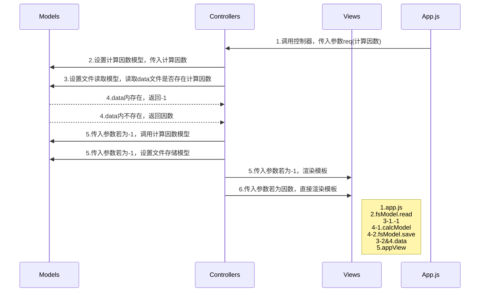
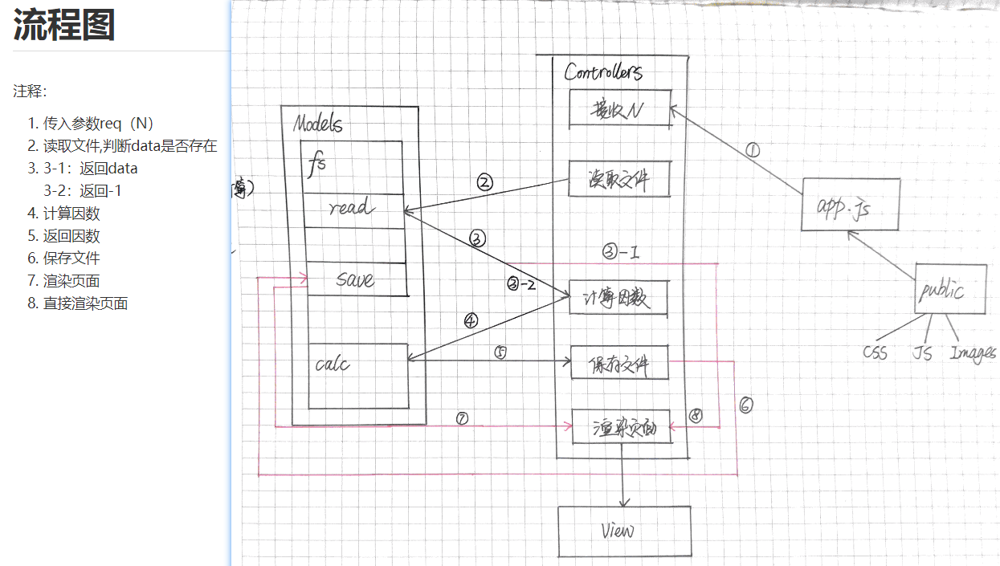
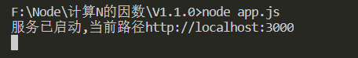
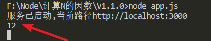
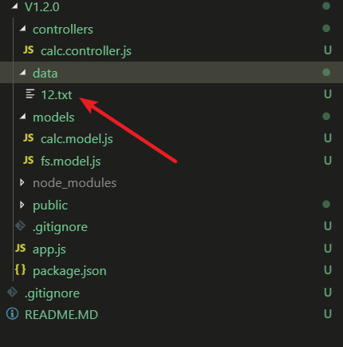
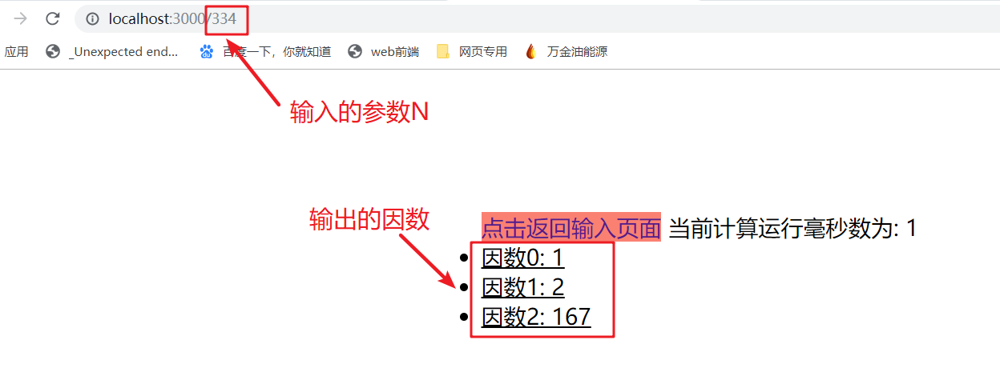

# 计算N的因数
## 流程图
### MD版

```mermaid
sequenceDiagram
    participant M as Models
    participant C as Controllers
    participant V as Views
    participant A as App.js
    A->>C: 1.调用控制器，传入参数req(计算因数)
    C->>M: 2.设置计算因数模型，传入计算因数
    C->>M: 3.设置文件读取模型，读取data文件是否存在计算因数
    M-->>C: 4.data内存在，返回-1
    M-->>C: 4.data内不存在，返回因数
    C->>M: 5.传入参数若为-1，调用计算因数模型
    C->>M: 5.传入参数若为-1，设置文件存储模型
    C->>V: 5.传入参数若为-1，渲染模板
    C->>V: 6.传入参数若为因数，直接渲染模板
    Note right of V: 1.app.js<br/>2.fsModel.read<br/>3-1.-1<br/>4-1.calcModel<br/>4-2.fsModel.save<br/>3-2&4.data<br/>5.appView          
   
```
### 手绘版

## 版本说明
### V1.0.0 开启node服务并设置静态html

### V1.1.0 设置控制器并获取输入参数

### V1.2.0 处理中间逻辑关系

### V1.3.0 渲染视图

